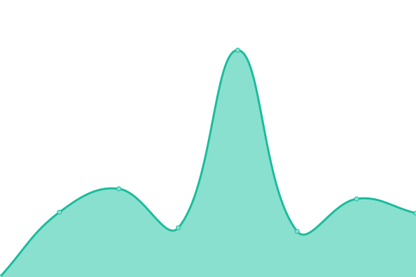
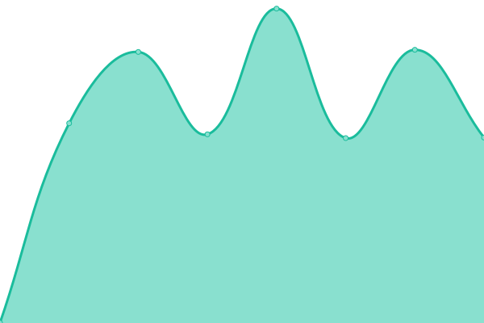
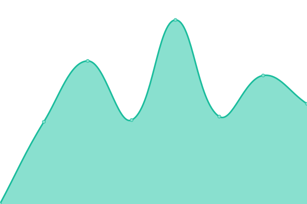

# [📈 Live Status](https://upptime.github.io/upptime): <!--live status--> **正常運作中**

This repository contains the open-source uptime monitor and status page for [Upptime](https://upptime.js.org), powered by [Upptime](https://github.com/upptime/upptime).

With [Upptime](https://upptime.js.org), you can get your own unlimited and free uptime monitor and status page, powered entirely by a GitHub repository. We use [Issues](https://github.com/upptime/upptime/issues) as incident reports, [Actions](https://github.com/Canboo/upptime/actions) as uptime monitors, and [Pages](https://upptime.github.io/upptime) for the status page.

<!--start: status pages-->
<!-- This summary is generated by Upptime (https://github.com/upptime/upptime) -->
<!-- Do not edit this manually, your changes will be overwritten -->
<!-- prettier-ignore -->
| 網址 | 狀態 | 歷史紀錄 | 回應速度 | 正常比例 |
| --- | ------ | ------- | ------------- | ------ |
|  [CIAOYU](https://www.ciaoyu.com.tw) | 🟩 正常 | [ciaoyu.yml](https://github.com/Canboo/upptime/commits/HEAD/history/ciaoyu.yml) | 

 366毫秒
     
 | 

<a href="https://upptime.ciaoyu.com.tw/history/ciaoyu">98.31%</a>
    

|  [NYCU-DISCUSS](https://discuss.ord.nycu.edu.tw/login) | 🟩 正常 | [nycu-discuss.yml](https://github.com/Canboo/upptime/commits/HEAD/history/nycu-discuss.yml) | 

 677毫秒
     
 | 

<a href="https://upptime.ciaoyu.com.tw/history/nycu-discuss">99.40%</a>
    

|  [NYCU-FUND](https://fund.nycu.edu.tw) | 🟩 正常 | [nycu-fund.yml](https://github.com/Canboo/upptime/commits/HEAD/history/nycu-fund.yml) | 

 954毫秒
     
 | 

<a href="https://upptime.ciaoyu.com.tw/history/nycu-fund">100.00%</a>
    

|  [NYCU-GA](https://ga.nycu.edu.tw) | 🟩 正常 | [nycu-ga.yml](https://github.com/Canboo/upptime/commits/HEAD/history/nycu-ga.yml) | 

 1056毫秒
     
 | 

<a href="https://upptime.ciaoyu.com.tw/history/nycu-ga">100.00%</a>
    

|  [NYCU-ORD](https://ord.nycu.edu.tw) | 🟩 正常 | [nycu-ord.yml](https://github.com/Canboo/upptime/commits/HEAD/history/nycu-ord.yml) | 

 821毫秒
     
 | 

<a href="https://upptime.ciaoyu.com.tw/history/nycu-ord">100.00%</a>
    

<!--end: status pages-->

[**Visit our status website →**](https://upptime.github.io/upptime)

## 📄 License

- Powered by: [Upptime](https://github.com/upptime/upptime)
- Code: [MIT](./LICENSE) © [Upptime](https://upptime.js.org)
- Data in the `./history` directory: [Open Database License](https://opendatacommons.org/licenses/odbl/1-0/)
